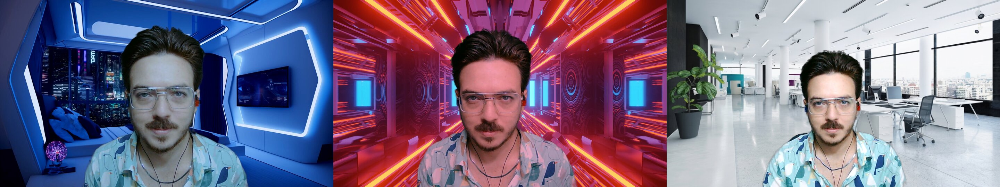
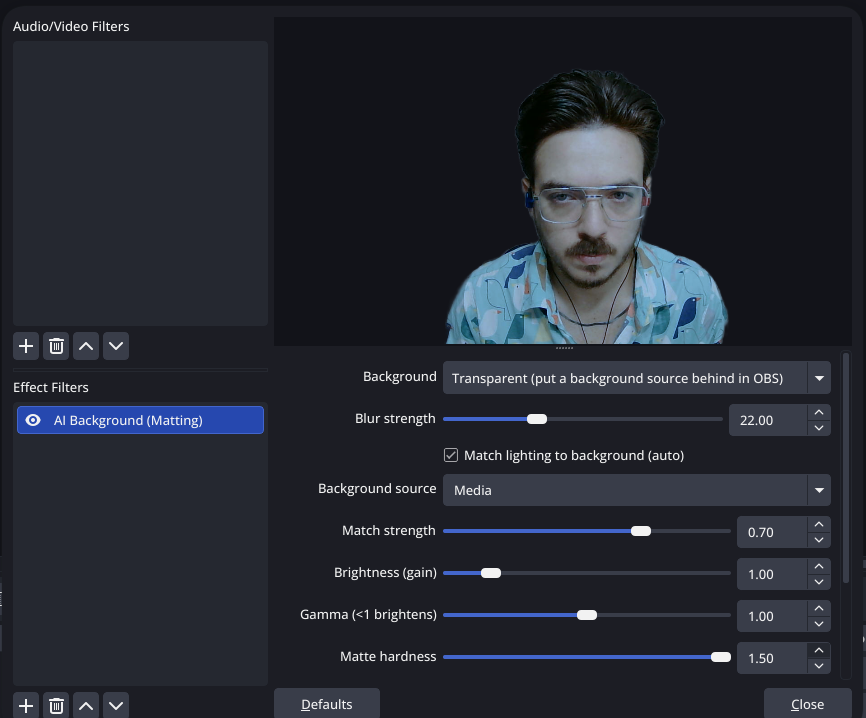

# obs-ai-matting — AI background removal for OBS Studio on Linux


**obs-ai-matting** is an open-source **OBS Studio filter for Linux** that removes, blurs or
replaces your webcam background in real time using AI **video matting** on the GPU. Think of
it as a **free, open-source [NVIDIA Broadcast](https://www.nvidia.com/en-us/geforce/broadcasting/broadcast-app/)
alternative for Linux** — a **virtual green screen** that works **without a physical green screen**.

It runs **[Robust Video Matting (RVM)](https://github.com/PeterL1n/RobustVideoMatting)** via
**ONNX Runtime + CUDA**, so the cut-out captures fine hair and soft edges and stays stable
frame-to-frame — far cleaner than the usual *segmentation*-based background removers.

**New in 0.2**: 💡 **auto light match** — the subject's exposure and white balance gently
follow the background you put behind it in OBS, so you actually look like you're *in* the
scene instead of pasted on top of it.

<p align="center">
  
  <br>
  <sub><b>Auto light match in action</b> — same camera, same pose, real time: skin tone cools
  down in the blue sci-fi room, picks up the warm cast in the neon tunnel, and brightens in
  the white office. (<a href="assets/lightmatch-scifi-blue.jpg">full-size 1</a> ·
  <a href="assets/lightmatch-neon-warm.jpg">2</a> ·
  <a href="assets/lightmatch-office-bright.jpg">3</a>)</sub>
</p>

> Built and tested on Arch/CachyOS Linux, OBS 32.x, ONNX Runtime 1.24 (CUDA), NVIDIA RTX.

---

## Why it looks better than other OBS background removers

| | Segmentation plugins (MediaPipe / Selfie / SINet) | **obs-ai-matting (RVM)** |
|---|---|---|
| Technique | Per-pixel "person yes/no" mask | **Alpha matting** (continuous 0–1) |
| Edges / hair | Hard, blocky, "cut with scissors" | **Soft, natural, keeps hair** |
| Stability | Flickers, needs heavy smoothing | **Temporally stable** (recurrent model) |
| Quality | Low | **Close to NVIDIA Broadcast** |

The key difference is **matting vs. segmentation**: matting predicts real transparency per
pixel (like a film matte), which is what makes the result look professional.

## Features

- 🟢 **Transparent** mode — outputs the person with alpha; drop any image, **video**, or color
  source *behind* the camera in OBS (native compositing, so any background works).
- 🌫️ **Background blur** mode — built-in, NVIDIA-Broadcast-style blur.
- 💡 **Auto light match** — samples the background source you picked in OBS and gently
  adjusts the subject's exposure and white balance so the cut-out **looks lit by the scene**
  (subtle by design; strength slider; temporally smoothed, no flicker).
- ⚡ **Threaded GPU inference** — low latency, doesn't stall OBS rendering (~30 fps).
- 🎚️ Per-filter settings: background mode, blur strength, **brightness / gamma** (for low
  light), matte hardness, and quality (384 / 512 / 720).
- 🌐 **Localized UI** — English and Spanish, following your OBS language automatically.

## Requirements

- OBS Studio 28+ (with `libobs` headers) — tested on 32.x
- ONNX Runtime with the **CUDA** execution provider (e.g. Arch `onnxruntime-opt-cuda`)
- NVIDIA GPU + CUDA + cuDNN (CPU fallback works but is slower)
- CMake and a C++17 compiler

## Build & install

```bash
cmake -B build -S .
cmake --build build
cmake --install build      # -> ~/.config/obs-studio/plugins/obs-ai-matting/
```

## Download the model (required, not bundled)

The RVM model is **not** shipped (it is GPL-3.0 and ~107 MB). Download it once:

```bash
mkdir -p ~/.config/obs-studio/plugins/obs-ai-matting/models
curl -L -o ~/.config/obs-studio/plugins/obs-ai-matting/models/rvm_resnet50.onnx \
  https://github.com/PeterL1n/RobustVideoMatting/releases/download/v1.0.0/rvm_resnet50_fp32.onnx
```

The plugin finds the model via: the **Modelo RVM (.onnx)** field in the filter → the
`$OBS_AI_MATTING_MODEL` env var → `~/.config/obs-studio/plugins/obs-ai-matting/models/` →
`~/ai-camera/models/`.

## Usage

1. Restart OBS.
2. Right-click your camera source → **Filters** → **+** → **AI Background (Matting)**.
3. Choose **Transparent** (then add an image/video/color source *below* the camera for the
   background) or **Blur** (built-in blur).
4. Tune brightness / gamma / hardness / quality.
5. *(Optional)* Enable **Match lighting to background (auto)** and pick your background
   source (or the whole scene) in **Background source** — the subject's light will subtly
   follow the background. **Match strength** controls how strong the match is.

<p align="center">
  
  <br>
  <sub>The filter's settings with <b>auto light match</b> enabled — while running at
  <b>60 fps with ~13% CPU</b> (laptop RTX 4050, 512 px matting).</sub>
</p>

## FAQ

**Is there a NVIDIA Broadcast for Linux?**
NVIDIA Broadcast itself is Windows-only. obs-ai-matting is an open-source alternative that
gives you AI background removal, blur and a virtual green screen inside OBS Studio on Linux.

**Does it work without a green screen?**
Yes. It's a *virtual* green screen — the AI separates you from any background, no physical
screen or special lighting needed.

**How is it different from the obs-backgroundremoval plugin?**
That plugin mostly relies on lightweight *segmentation* models, which produce hard, blocky
masks. obs-ai-matting uses the **RVM matting** model (continuous alpha + temporal stability),
so edges and hair look much more natural and don't flicker.

**Do I need an NVIDIA GPU?**
It's optimized for NVIDIA + CUDA via ONNX Runtime. It can fall back to CPU, but a GPU is
recommended for real-time use.

**Can I use an image or a video as the background?**
Yes — use **Transparent** mode and place any OBS Image or Media (video) source behind the
camera. OBS composites it for you.

**Can the subject's lighting match the background?**
Yes — enable **auto light match** and select the background source (a scene works too: the
plugin measures "the scene without you"). It nudges exposure and white balance toward the
background's average light — a warm background warms you up slightly, a dark one dims you a
bit — with tight clamps so you always stay readable and never get tinted.

**Is it real-time?**
Yes. Inference runs on a background thread on the GPU at roughly 30 fps at 512px matting.

## How it works

`video_render` captures the source frame (texrender → stage surface → CPU BGRA), applies a
brightness LUT, and hands the frame to a worker thread that runs RVM on CUDA (carrying the
recurrent states for temporal stability). The render thread composites the latest alpha
(≈1 frame latency) — transparent (premultiplied) or blurred — and draws it.

**Auto light match**: every 15 frames the filter renders the selected background source at
64×36 (GPU downscale) and takes its alpha-weighted mean color; the worker computes the
subject's mean color (alpha-weighted, on the small inference buffers). From both means it
derives partial-exposure (`(Yb/Yf)^0.55`, clamped) and white-balance per-channel gains,
smoothed with an EMA and baked into per-channel LUTs applied at composition time. The
subject stats are taken *before* the auto adjustment, so there is no feedback loop. If the
background is a scene containing the camera itself, a re-entrancy guard makes the camera
contribute nothing to the sample — the measurement is exactly "the scene without you".

## Contributing

Issues, feature requests and pull requests are welcome — see [CONTRIBUTING.md](CONTRIBUTING.md).

## Credits & license

- Matting model: **[Robust Video Matting](https://github.com/PeterL1n/RobustVideoMatting)** by
  Peter Lin et al. (GPL-3.0) — downloaded separately.
- Inference: **[ONNX Runtime](https://onnxruntime.ai/)** (MIT).
- This plugin links `libobs`, so it is released under the **GPL-2.0** (see [LICENSE](LICENSE)).

---

<sub>Keywords: OBS Studio background removal Linux, OBS virtual background, OBS background
blur, virtual green screen Linux, NVIDIA Broadcast alternative Linux, AI webcam background,
robust video matting, ONNX Runtime CUDA, real-time portrait matting, auto light match,
match webcam lighting to background, relight webcam OBS.</sub>
